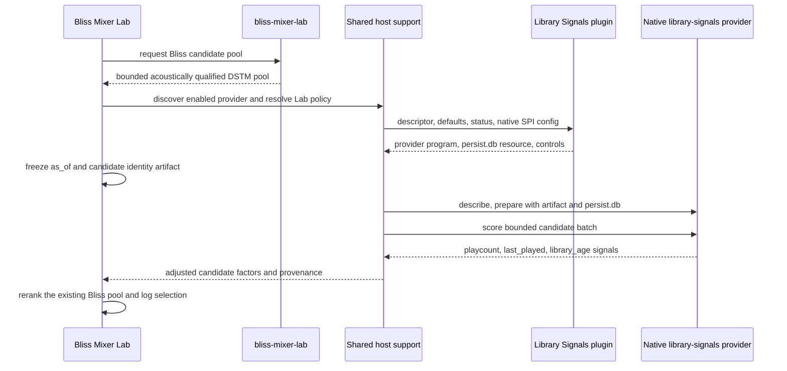

# Guidance-provider host integration for Bliss Mixer Lab

## Purpose

This document records the delivered guidance-provider integration in **Bliss
Mixer Lab**. Lab is a Lyrion host for discoverable guidance providers.

The shipped provider is **Bliss Guidance: Library Signals**. When enabled for
Lab, it replaces Lab's current direct local-signal implementation for all of
the following reranking inputs:

- play count;
- last played; and
- library age.

Bliss remains the first authority.  Lab first receives its acoustically
qualified DSTM candidate pool from `bliss-mixer-lab`; provider signals only
rerank that bounded pool.  They cannot add candidates, relax repeat or genre
rules, or change the configured Bliss strategy.

This is a Lab-plugin integration. The forked native `bliss-mixer` binary now
also exposes the first Library Signals guidance-host endpoint and
`selection_trace_v1`. When a native provider is enabled, Lab already submits
its bounded DSTM candidate pool to that endpoint and retains its established
selection policy and log formatter on the Perl side.

## Shared host support - delivered

The reusable discovery, policy, settings-model, and canonical settings assets
live in the source-only `lms-bliss-guidance-host` package. Both Better Call
Bliss and Lab vendor the same tested source in their release archives rather
than requiring a separate Lyrion dependency. This is intentional source
vendoring, not parallel host-side implementations.

It provides these provider-neutral Perl modules:

| Module | Responsibility |
| --- | --- |
| `Plugins::BlissGuidance::Discovery` | Enumerate enabled Lyrion plugins that expose the v1 provider methods; validate descriptors, defaults, status, duplicate IDs, and native SPI metadata. |
| `Plugins::BlissGuidance::Policy` | Resolve provider default, host override, and optional invocation override values with their provenance. |
| `Plugins::BlissGuidance::Runtime` | Start one bounded JSONL SPI session, send `describe`, `prepare`, `score`, and `close`, validate replies, enforce a deadline, and return neutral failure diagnostics. |

The package is not a Lyrion extension and has no settings page or runtime
registration. Provider-kit and host parity tests protect the shared contract
against visual or behavioral drift between Better Call Bliss and Lab.

## Lab data flow

For each mix request Lab writes a short-lived
`eligible-candidate-identities-v1` artifact containing only the existing DSTM
candidate pool and the identities required by the provider.  It freezes one
`as_of_unix_seconds` value, obtains the provider's read-only `persist.db`
resource through its Lyrion method, and sends one bounded score batch.  The
provider reads no full-library snapshot and the host never passes a user-supplied
database path or executable.

The normal DSTM pool is small.  Lab must impose a strict provider deadline and
fall back safely if it expires, returns malformed data, or is unavailable.  The
initial deadline is 500 ms for the complete `describe`/`prepare`/`score` session
on a local server. It is a host constant, verified by the host/provider tests,
and is not a user setting in this slice.

## Settings and migration

Lab adds an **Optional guidance providers** section matching Better Call
Bliss's behavior:

- Every discovered provider is disabled by default for this host.
- Provider-owned settings remain on the provider's own settings page.
- Enabling a provider reveals only descriptor-declared Lab overrides.
- Effective values identify their origin: provider default or Lab override.
- The control presentation declared by the provider is preserved: sliders stay
  sliders and numeric horizons remain value fields.

When Library Signals is enabled, its three channels replace Lab's direct
play-count, last-played, and library-age factors as one coherent local-signal
layer.

Lab's Last.fm track/artist guidance now resolves its source and reranking
policy from the discoverable `lms-guidance-lastfm` provider. The established
direct LastMix adapter remains the acquisition implementation for this host;
the provider's API Key mode is deliberately neutral until native direct
acquisition is wired into Lab. No obsolete Lab-owned Last.fm preferences are
read or rendered.

The first enablement migrates the current Lab last-played and library-age values
into Lab host overrides.  It copies the current upstream Bliss Mixer
play-count influence into Lab's provider override without changing the upstream
preference.  This preserves the current Lab intent while allowing the provider
to own all three signals.  The old preferences remain stored temporarily only
so disabling the provider can restore the current Lab path during the staged
rollout.

## Failure behavior and logging compatibility

If the Library Signals provider is disabled, Lab uses its current direct local
reranking path.  If it is enabled but unavailable, times out, or returns an
invalid response, Lab does not invoke the old path as a hidden second attempt:
the provider's three signals are neutral for that selection. The same
provider-first rule applies to Last.fm: a disabled or unsupported source is
neutral; Lab never falls back to the removed Lab-owned Last.fm preferences.

Lab's current INFO and DEBUG logging is a compatibility boundary.  Its
candidate-selection summary, selected-track lines, diagnostics, and selection
lines must retain their current format, ordering, labels, and level.  The
provider adapter therefore normalizes native signals into the existing Lab
candidate-profile fields before the established logging code runs.  It must not
append provider IDs, SPI terminology, native timing, or new provenance text to
those lines.  A provider-enabled success should be indistinguishable in format
from the current direct path; only the already logged values may differ when
the effective signal differs.

Provider operational detail belongs to the provider's own status surface and
tests, not to new Lab selection log lines.  An enabled-provider failure follows
the existing neutral-factor logging path, preserving a valid Bliss selection
without adding a second, provider-specific Lab diagnostic line.

## Migration and cleanup status

`BlissMixerLab::LocalLibrarySignals` and Lab's direct local-signal wiring are
retained only as the disabled-provider fallback. The enabled Library Signals
path is the generic descriptor and native-SPI path described above. Removing
the fallback remains a deliberate cleanup decision after these gates pass:

1. Frozen candidate fixtures produce equivalent play-count, last-played, and
   library-age factors through the provider path.
2. Neutral provider settings do not alter the Bliss order.
3. Positive and negative influence cases select and log the expected direction.
4. Missing metadata and `lastPlayed == 0` retain their documented behavior.
5. Provider failure leaves a valid mix and reports neutralization.
6. Pi measurements meet the 500 ms budget without full-library memory use.
7. Existing Lab INFO and DEBUG selection-log fixtures remain byte-for-byte
   stable for equivalent normalized candidate profiles.

After those gates, remove the direct local-signal code and its now-obsolete Lab
settings.  A provider-disabled Lab will then simply omit local guidance rather
than keep two implementations indefinitely.

## Out of scope

- Direct Last.fm acquisition by `bliss-guidance-lastfm`.
- Replacing Lab's LastMix integration.
- Automatic installation of provider plugins.
- Alternative Play Count guidance; that remains a separate future provider.
- Wiring the forked native `bliss-mixer` binary itself to the SPI.
