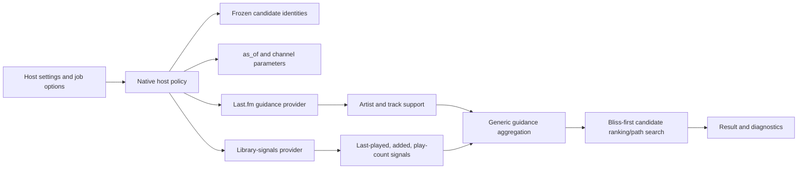

# Migrating Lab reranking semantics to Rust guidance hosts

> **Status (2026-10-04): Library Signals native path delivered; Last.fm
> artifact semantics delivered for the optimizer/Better Call Bliss path.**
> `bliss-mixer` 0.11.4 exposes a Library Signals guidance-host endpoint with
> bounded SPI execution and `selection_trace_v1`. Lab already submits its
> native-provider DSTM candidate pool to that endpoint; this document tracks
> provider parity and future trace consumption without changing Lab's existing
> selection or logging ownership. Better Call Bliss uses the Last.fm provider's
> artifact mode; Lab's DSTM still uses its direct LastMix adapter. Migrating
> Lab's Last.fm path to the discoverable provider, and direct API-key
> acquisition, are future work.

This document plans the Rust equivalent of the experimental reranking behavior
currently implemented in the BlissMixerLab Perl plugin. It is a migration plan,
not a description of the current Perl implementation. The goal is semantic
parity first; the Rust hosts may later optimize the execution.

The separate Lab-plugin integration with discoverable Lyrion providers is
specified in [GUIDANCE_PROVIDER_HOST_INTEGRATION.md](GUIDANCE_PROVIDER_HOST_INTEGRATION.md).
That integration uses a native provider from Lab's Perl-side DSTM flow; it does
not itself make the forked `bliss-mixer` binary a Rust SPI host.

## Scope

The following Lab behaviors need native equivalents:

- Last.fm artist reranking with two explicit modes:
  - **bounded artist influence**, the Lab default;
  - **target endorsed share**, the BlissMixer-compatible mode.
- Last.fm track-similarity guidance, including bounded candidate influence and
  evidence/provenance reporting.
- Last-played reranking using a signed influence and a saturating time horizon.
- Library-age reranking using a signed influence and a saturating time horizon.
- Explicit handling of never-played and missing timestamps.
- Run-wide deterministic `as_of` time and diagnostics that explain the applied
  provider contributions.

These behaviors must remain advisory. Bliss still owns candidate admission,
acoustic similarity, repeat windows, genre filters, and route validity.

## Current Perl-to-Rust mapping

| Lab behavior | Rust destination | Required contract |
| --- | --- | --- |
| Bounded Last.fm artist influence | `bliss-guidance-lastfm` signal plus generic host aggregation | Candidate-level artist match/support, configured influence, provenance |
| Target endorsed share | Host policy compatible with BlissMixer semantics | Best-effort target share, not an unbounded multiplier |
| Last.fm track guidance | `bliss-guidance-lastfm` track channel | Recording identity/support, bounded track influence, provenance |
| Last-played signal | `bliss-guidance-library-signals` | Candidate timestamp, `as_of`, horizon, signed influence |
| Library-age signal | `bliss-guidance-library-signals` | Candidate `added` timestamp, `as_of`, horizon, signed influence |
| Play-count signal | Existing play-count provider, later generalized | Same bounded global-candidate signal model |

`bliss-guidance-library-signals` is the delivered evolution of the narrowly
scoped play-count provider. APC remains a separate future provider; it must not
be silently mixed into the built-in Lyrion metadata provider.

## Shared signal semantics

For a timestamp `t`, a single run-wide reference time `as_of`, and a horizon `H`
days, the date provider computes:

```text
remaining = exp(-(as_of - t) / (H days))
signal = 2 * remaining - 1
weight = 10 ^ (influence / 100 * signal)
```

The host applies the resulting weight only after Bliss has admitted the
candidate. Consequences that must remain stable across Perl and Rust:

- positive last-played influence favors recently played tracks;
- negative last-played influence favors tracks played longer ago;
- positive library-age influence favors newly added tracks;
- negative library-age influence favors older additions;
- dates several horizons apart converge instead of remaining rank-distinct;
- missing timestamps produce a neutral contribution;
- `lastPlayed == 0` means “never played” and produces the maximally overdue
  signal; and
- one `as_of` value is used for every candidate in a run.

The current defaults and UI ranges are:

| Channel | Influence | Horizon | Default horizon |
| --- | ---: | ---: | ---: |
| `last_played` | `-100..100` | `30..1825` days | `180` days |
| `library_age` | `-100..100` | `30..3650` days | `365` days |

The horizon is an e-folding saturation constant. At one horizon the raw
exponential is about `36.8%`; it is not a hard age cutoff.

## Last.fm artist modes

### Bounded artist influence

The provider returns a candidate-level artist support value, normally `0` or
`1` after resolving the seed and candidate identities. The generic host applies
the configured influence as a bounded multiplier comparable to other guidance
channels. At the Lab defaults, an endorsed candidate receives at most about a
`1.8x` boost.

The provider does not decide whether the candidate is selected and does not
apply the host's target-share policy itself.

### Target endorsed share

This mode is retained for BlissMixer compatibility. The host treats the
configured percentage as a best-effort target share of selected candidates with
artist support. It must not be implemented as the bounded artist multiplier,
because sparse matches can produce very different behavior.

The mode belongs in host policy rather than in the Last.fm provider. The same
artist evidence can therefore be used by BlissMixer's target-share policy and
by Better Call Bliss or the optimizer's bounded influence policy.

## Data and information flow



The host supplies the enabled-provider policy and the bounded candidate batch.
The Last.fm provider consumes the existing resolved evidence artifact during the
hybrid migration; direct acquisition remains a later provider-owned option.
The library-signals provider consumes trusted Lyrion identities and performs
bounded read-only lookups. Neither provider receives an unrestricted library
scan or a user-supplied executable/database path.

The result must identify, per provider and channel:

- whether it was enabled and available;
- input/cache/snapshot state;
- candidates with usable support;
- candidates whose score was actually adjusted;
- effective influence/horizon/target policy; and
- neutralized failures or missing identity coverage.

## Host integration

Better Call Bliss and both native hosts use the same provider contract but apply
signals at different boundaries.

### Better Call Bliss integration

Better Call Bliss remains the Lyrion-facing owner of user intent and job
policy. Its integration responsibilities are:

- discover registered guidance providers through the Lyrion registry;
- show each discovered provider as disabled by default and let the user enable
  it explicitly for the host or a job;
- render provider-declared influence, horizon, target-share, and timeout fields
  through the host's schema-driven settings section;
- keep provider-owned credentials and acquisition settings out of the host
  preference namespace;
- capture the immutable source snapshot, candidate identity map, selected
  virtual-library boundary, and one `as_of` timestamp;
- translate the effective host/job settings into the optimizer's generic
  provider policy without embedding provider-specific ranking code;
- provide Last.fm evidence artifacts and trusted Lyrion resource descriptors as
  required by the selected providers; and
- render provider availability, contribution counts, neutralized failures,
  effective settings, and provenance in the preview report.

Better Call Bliss does not perform the final reranking after the optimizer
returns. The optimizer applies the guidance while choosing additions, bridge
tracks, partial paths, and completed routes. Better Call Bliss persists or
queues only the optimizer's resulting Bliss-valid route.

The three hosts share the same policy vocabulary, but their outer workflows
remain distinct:

- `bliss-playlist-optimizer` applies guidance while choosing additions,
  bridge paths, partial routes, and completed routes;
- `bliss-mixer` applies guidance while reranking its existing Bliss-derived DSTM
  candidate pool.
- Better Call Bliss captures Lyrion context and presents the optimizer's
  guidance-aware preview and diagnostics to the user.

Host settings must remain explicit and disabled by default. Provider-owned
source settings stay in the provider; host settings control enablement,
influence, horizon, target mode, timeout, and per-job overrides.

## Migration phases

1. Add provider-neutral channels and diagnostics to
   `bliss-playlist-guidance-spi`.
2. Extend `bliss-guidance-lastfm` with artist and track support fixtures that
   match the Lab identity and provenance rules.
3. Evolve `bliss-guidance-playcounts` into
   `bliss-guidance-library-signals`, adding the two saturating date channels.
4. Add shared Rust aggregation helpers for bounded influence and target-share
   policies; do not duplicate them in each host.
5. Integrate Better Call Bliss with provider discovery, host policy, trusted
   artifacts/resources, preview provenance, and Bliss-only fallback.
6. Integrate the optimizer host and compare Perl/Rust decisions on frozen
   candidate fixtures.
7. Deliver the first `bliss-mixer` native host endpoint. **Delivered in
   `bliss-mixer` 0.11.4.**
8. Keep Lab's normal DSTM candidate selection and logging host-owned while
   extending its existing endpoint path to additional providers; consume richer
   selection traces only after parity, failure, and performance tests pass.

### Phase status at 2026-10-04

- Phases 1-7 are delivered for the optimizer/Library Signals path and the
  native `bliss-mixer` endpoint.
- Lab's Library Signals migration is delivered and preserves the existing
  Perl-side log formatter.
- Lab's Last.fm DSTM path still uses its direct LastMix adapter; migrating it
  to the discoverable provider is not complete.
- The native Last.fm provider currently consumes resolved artifacts only. Its
  provider-owned API Key acquisition/cache path is not implemented yet.

## Acceptance criteria

- Rust and Perl produce equivalent channel weights for the same frozen inputs.
- Five- and six-year-old dates no longer receive materially different weights
  solely because of candidate-pool rank.
- Never-played and missing metadata behavior is explicitly tested.
- Last.fm bounded and target-share modes remain distinguishable in results and
  diagnostics.
- Disabled providers produce Bliss-only behavior.
- Provider failures leave valid Bliss results and explain the neutralization.
- Candidate batches remain bounded; no full-library date artifact is required.
- Multi-core or asynchronous provider work is used where it helps, without
  unbounded memory growth or request fan-out.
